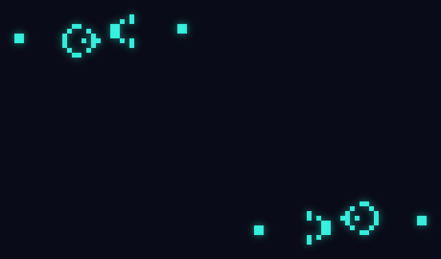

# Conway's Game of Life — Phosphor Edition



A desktop Game of Life simulator with age-based coloring, live drawing, and a
built-in preset library — including the Gosper Glider Gun shown above.

> The GIF isn't a screen recording of the app. I'ts rendered by
> [`generate_gif.py`](generate_gif.py), a small headless simulator with a
> phosphor-persistence trail effect and a bloom pass. Two mirrored glider guns
> fire at each other; the streams eventually feed back into the guns
> themselves and the whole thing blooms into something closer to coral growth
> than a grid of squares.

## Features

- **Classic rules, real-time simulation** — adjustable speed, click-and-drag to draw
- **Age-based coloring** — cells shift color the longer they survive, so stable structures read differently from active ones at a glance
- **Preset library** — Glider, Pulsar, Lightweight Spaceship, one click to drop in
- **Toroidal grid** — patterns wrap at the edges instead of dying at a wall
- **Live stats** — generation counter and population readout

## Why this isn't just another Life clone

Most student implementations stop at "grid + rules + start button." Two
things push this one further:

1. **The visualization is decoupled from the simulation.** The same
   generation logic (birth/survival rules, neighbor counting) backs both the
   interactive Tkinter app and the standalone renderer used to produce the
   GIF above — so the "flashy" version isn't a one-off hack, it's built on
   the same core.
2. **The GIF renderer treats the simulation as an art piece**, not just a
   debug output: it tracks per-cell brightness with exponential decay
   (phosphor persistence), maps cell age to a color ramp, and applies a
   Gaussian-blur bloom pass so moving gliders leave glowing comet trails.

## Quick start

```bash
python3 main.py
```

Requires Python 3 with Tkinter (bundled with most standard installs).

To regenerate the demo GIF yourself:

```bash
pip install pillow numpy
python3 generate_gif.py
```

## Controls

| Action | Effect |
|---|---|
| Click / drag on the grid | Bring cells to life |
| Démarrer / Pause | Start or pause the simulation |
| Aléatoire | Reseed with a random population |
| Effacer | Clear the grid |
| Preset dropdown | Drop in a known pattern (glider, pulsar, spaceship) |
| Speed slider | Control simulation speed |

## Background

Conway's Game of Life is a zero-player cellular automaton: every cell's fate
each generation is decided by exactly four rules based on its live
neighbors. From those four rules alone come gliders, guns that fire them
forever, and as the demo above shows, genuinely unpredictable, organic,
looking growth from two very simple, deterministic machines pointed at each
other.
